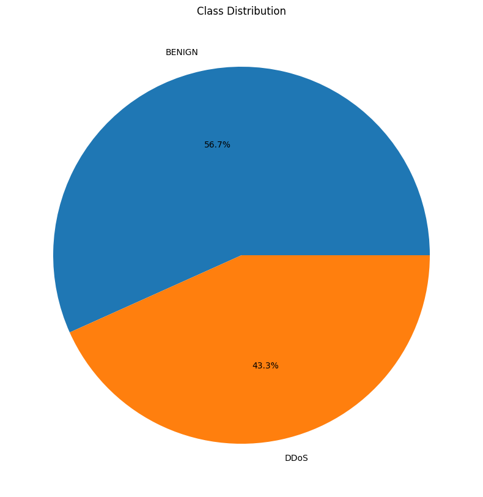
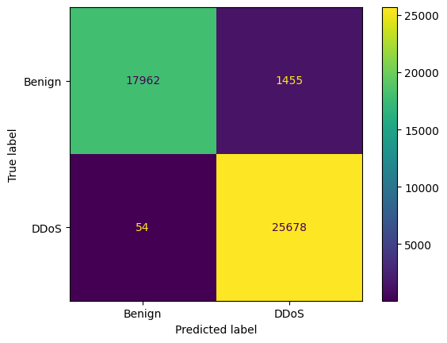

# **Riset Informatika ( C )**

# Deteksi Serangan DDoS dengan Support Vector Machine

Nama : Novandi Kevin Pratama

NPM : 20081010005

## Daftar Isi
1. [Dataset](#dataset)
2. [Latar Belakang](#latar-belakang)
3. [Tujuan](#tujuan)
4. [Rumusan Masalah](#rumusan-masalah)
5. [Teori Terkait](#teori-terkait)
6. [Metode yang Digunakan](#metode-yang-digunakan)
7. [Hasil](#hasil)
8. [Referensi](#referensi)
9. [Video](#video)

## Dataset
<a href="https://www.kaggle.com/datasets/aymenabb/ddos-evaluation-dataset-cic-ddos2019/">DDoS Evaluation Dataset (CIC-DDoS2019)</a>

## Latar Belakang
DDoS (Distributed Denial of Service) adalah jenis serangan yang dilakukan dengan cara membanjiri lalu lintas jaringan dengan paket data yang tidak berguna. Tujuan dari serangan ini adalah untuk membuat sumber daya jaringan (misalnya: bandwidth, memori, atau CPU) tidak tersedia untuk pengguna yang sah. Serangan DDoS dapat dilakukan dengan menggunakan satu komputer yang terinfeksi malware. Namun, serangan DDoS modern lebih sering dilakukan dengan menggunakan botnet. Serangan DDoS dapat menyebabkan kerugian finansial dan reputasi yang signifikan bagi organisasi yang menjadi korban serangan. Oleh karena itu, penting untuk mengembangkan teknik deteksi DDoS yang efektif. 

## Tujuan
Membuat model machine learning untuk mendeteksi serangan DDoS dengan menggunakan dataset DDoS Evaluation Dataset (CIC-DDoS2019) yang diambil dari Kaggle.

## Rumusan Masalah
1. Bagaimana cara mendeteksi serangan DDoS dengan menggunakan dataset DDoS Evaluation Dataset (CIC-DDoS2019)?
2. Bagaimana cara membangun model machine learning untuk mendeteksi serangan DDoS dengan menggunakan dataset DDoS Evaluation Dataset (CIC-DDoS2019)?
3. Bagaimana cara mengevaluasi model machine learning untuk mendeteksi serangan DDoS dengan menggunakan dataset DDoS Evaluation Dataset (CIC-DDoS2019)?

## Teori terkait
**1. Support Vector Machine**

Support Vector Machine (SVM) adalah algoritma pembelajaran mesin yang dapat digunakan untuk melakukan klasifikasi maupun regresi. SVM melakukan klasifikasi dengan membangun hyperplane dalam ruang multidimensi yang dapat memisahkan dua kelas. Hyperplane adalah sebuah fungsi yang dapat digunakan untuk melakukan pemisahan antar kelas. Hyperplane yang memisahkan dua kelas dengan margin terbesar disebut dengan Maximal Margin Hyperplane. Margin adalah jarak antara hyperplane dengan sampel terdekat. Semakin besar margin, semakin baik pula model yang dihasilkan.

**2. DDos**
   
DDoS (Distributed Denial of Service) adalah jenis serangan yang dilakukan dengan cara membanjiri lalu lintas jaringan dengan paket data yang tidak berguna. Tujuan dari serangan ini adalah untuk membuat sumber daya jaringan (misalnya: bandwidth, memori, atau CPU) tidak tersedia untuk pengguna yang sah. Serangan DDoS dapat dilakukan dengan menggunakan satu komputer yang terinfeksi malware. Namun, serangan DDoS modern lebih sering dilakukan dengan menggunakan botnet.

**3. Normalisasi Data** 

Normalisasi data adalah proses mengubah nilai-nilai dari beberapa variabel sehingga variabel-variabel tersebut memiliki skala yang sama. Normalisasi data dilakukan untuk menghindari bias yang mungkin terjadi pada data. Normalisasi data dapat dilakukan dengan menggunakan MinMaxScaler. MinMaxScaler akan mengubah nilai-nilai dari suatu fitur menjadi nilai antara 0 dan 1. MinMaxScaler bekerja dengan cara mengurangi nilai terkecil dari setiap fitur dan membaginya dengan rentang nilai yang ada.

**4. Label Encoding**

Label Encoding adalah proses mengubah nilai-nilai dari suatu fitur menjadi nilai numerik. Label Encoding dilakukan untuk mengubah nilai-nilai dari fitur kategorikal menjadi nilai numerik. Label Encoding dapat dilakukan dengan menggunakan LabelEncoder. LabelEncoder akan mengubah nilai-nilai dari suatu fitur menjadi nilai numerik secara berurutan.

## Metode yang digunakan
1. Data Preprocessing
2. Data Splitting
3. Model Training
4. Model Evaluation

### **Data Preprocessing**
Data preprocessing dilakukan untuk membersihkan data dari noise dan data yang tidak berguna. Data preprocessing yang dilakukan adalah sebagai berikut:
1. Data Cleaning
2. Normalisasi data menggunakan MinMaxScaler
3. Label Encoding
4. Feature Selection menggunakan SelectKBest dan ChiSquare

### **Data Splitting**
Data splitting dilakukan untuk membagi data menjadi data training dan data testing. Data training digunakan untuk melatih model sedangkan data testing digunakan untuk menguji model. Data splitting ditetapkan dengan rasio 80:20. Data training sebanyak 80% dan data testing sebanyak 20%. 

### **Model Training**
Training model dilakukan dengan menggunakan algoritma SVM (Support Vector Machine). 

### **Model Evaluation**
Evaluation model dilakukan dengan menggunakan confusion matrix. Confusion matrix digunakan untuk menghitung nilai akurasi, presisi, recall, dan f1-score. Confusion matrix juga digunakan untuk menghitung nilai True Positive, True Negative, False Positive, dan False Negative.

## Hasil
### Data Distribution

### Confusion Matrix

### Classification Report
               precision    recall  f1-score   support

      Benign       1.00      0.93      0.96     19417
        DDoS       0.95      1.00      0.97     25732
    accuracy                           0.97     45149
    macro avg      0.97      0.96      0.97     45149
    weighted avg   0.97      0.97      0.97     45149

## Referensi

1. H. Tekleselassie, “A deep learning approach for ddos attack detection using supervised learning,” MATEC Web of Conferences, vol. 348, p. 01012, 2021. 
2. Y. Wu, “DDos attack detection method based on machine learning,” Applied and Computational Engineering, vol. 18, no. 1, pp. 88–95, 2023.

## Video

<iframe width="560" height="315" src="https://www.youtube.com/embed/GhG2qG5sRcc?si=4OHX4vzVlhX3C6Te" title="YouTube video player" frameborder="0" allow="accelerometer; autoplay; clipboard-write; encrypted-media; gyroscope; picture-in-picture; web-share" allowfullscreen></iframe>